# Exploring Behavioural Diversity under Information Asymmetry and Policy Composition in MARL
This project implements a Multi-Agent Proximal Policy Optimization (MAPPO) framework to train agents in a football environment using TorchRL and VMAS.

This project also explores the role of how information asymmetry and policy composition affects behavioural diversity and the emergent roles that occur i.e. how agents adapt their strategies (e.g. learning to defend by proxy) when critical sensory data, such as ball position or opponent visibility, is masked based on spatial or proximity constraints.

Furthermore, it explores whether information asymmetry itself e.g. masking observation, can act as a sufficient condition for policy divergence and role specialisation. Also, when composing such specialised policies into a multi-agent team, what behaviours occur compared to just a monolithic team of generalists, and what conditions can cause such teams to perform as well.


## Information Asymmetry Flags

| Flag | Category | Logic Description |
| :--- | :--- | :--- |
| `mask_pitch_lhs` | **Spatial** | Agent is "blind" to external objects when its own $X$-coordinate is e.g. $< 0.0$ (Left Half) of the pitch. |
| `mask_pitch_rhs` | **Spatial** | Agent is "blind" to external objects when its own $X$-coordinate is e.g. $> 0.0$ (Right Half) of the pitch. |
| `mask_pitch_bhs` | **Spatial** | Agent is "blind" to external objects when its own $Y$-coordinate is e.g. $< 0.0$ (Bottom Half) of the pitch. |
| `mask_pitch_ths` | **Spatial** | Agent is "blind" to external objects when its own $Y$-coordinate is e.g. $> 0.0$ (Right Half) of the pitch. |
| `mask_ball` | **Sensory** | Masks ball information e.g. position and velocity from agent during training. |
| `mask_opponent` | **Sensory** | Masks opponent information e.g. position and velocity from agent during training. |
| `mask_ball_by_distance` | **Proximity** | Ball information is masked dependant on `DISTANCE_THRESHOLD` and the distance between the agent and the ball. |
| `mask_opponent_by_distance` | **Proximity** | Opponent information is masked dependant on `DISTANCE_THRESHOLD` and the distance between the agent and the ball. |
| `mask_if_far` | **Logic** | **True**: Masking occurs when distance is **LARGE** (Standard). <br>**False**: Masking occurs when distance is **SMALL** (Inverted). <br>This flag has to be set to the appropriate value if masking by distance. |


### Example configuration

```python
asymmetries = AsymmetryConfig(
    masks=ObservationMasks(
        mask_pitch_rhs=[False, True],  # agent 0 sees rhs, agent 1 doesn't
    ),
    opponent=OpponentDifficulty(
        ai_strength=1.5,
        ai_decision_strength=1.0,
        ai_precision_strength=1.0,
    )
)
```


## Conjectures
**Conjecture 1** (information asymmetry can induce specialised roles). information asymmetry ($\phi_{i} \neq \phi_{j}$) is a sufficient condition to force functional policy divergence, engineering specialised roles as a byproduct of the observation constraint. This can be quantified via system neural diversity (SND), so is successful if $SND(\Pi_{spec}) > SND(\Pi_{base})$ where $SND(\Pi_{spec}) = \mathbb{E}_{s \sim S}[D_{KL}(\pi_{a}(\cdot|s) || \pi_{b}( \cdot |s))]$.

**Conjecture 2** (a specialised composed team can collectively be sufficient). a team $\Pi_{spec}$ achieves collective sufficiency if the functional union of its individual value function approximates the total utility of the monolithic baseline $\Pi_{base}$ across the pitch:
$$
\int_{S} V_{base}(s)ds \approx \int_{S} \max \left( \frac{V_{\pi_{a}}(s)}{\int_{S} V_{\pi_{a}}(s')ds'}, \frac{V_{\pi_{b}}(s)}{\int_{S} V_{\pi_{b}}(s')ds'} \right) \cdot Z \, ds
$$
where $Z$ is a constant. While policies $\pi_{a}$ and $\pi_{b}$ may individually be suboptimal, combining them could 'cover' the state space and potentially perform as well as $\Pi_{base}$.

**Conjecture 3** (specialisation can lead to matching rewards). it is possible for a team $\Pi_{spec}$ to achieve matching or better task performance compared to a monolithic baseline $\Pi_{base}$. This can be shown if the cumulative reward $R$ of the specialised team satisfies $R(\Pi_{spec}) \geq R(\Pi_{base}) - \epsilon$ where $\epsilon$ is a small tolerance.


## Results: 1v1 Emergent Behaviours

### Baseline (Full Observability)
**Flags:** `None`  
**Description:** Agent has access to full state information.

**Observed Behaviour:**
- Learns standard offensive play
- Successfully scores toward the end of training

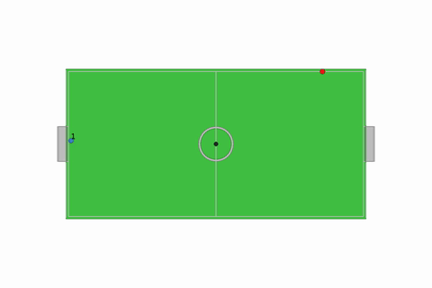

---

### Spatial Masking
#### `mask_pitch_rhs` — Right Side Masked
**Description:**  Agent cannot perceive ball or opponent when on the offensive (right) side.

**Observed Behaviour:**
- Stays near own goal
- Acts as a **goalkeeper-like agent**

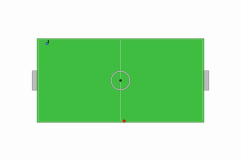

---

#### `mask_pitch_lhs` — Left Side Masked
**Description:** Agent cannot perceive ball/opponent in defensive region.

**Observed Behaviour:**
- Operates in midfield
- Intercepts opponent
- Hybrid **defensive/midfield role**

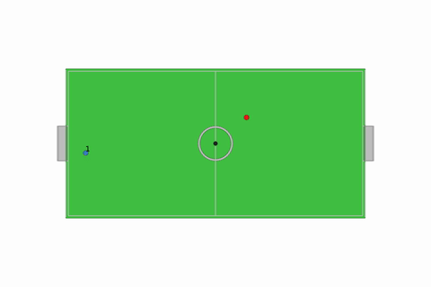

---

#### `mask_pitch_bhs` — Bottom Half Masked
**Observed Behaviour:**
- Avoids bottom region entirely
- Still maintains scoring ability

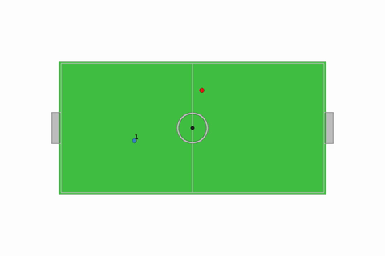

---

#### `mask_pitch_ths` — Top Half Masked
**Observed Behaviour:**
- Avoids top region
- Plays cautiously near boundary
- More defensive tendencies

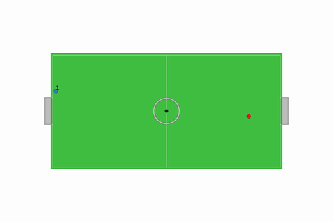

---

### Entity Masking
#### `mask_ball` — Ball Hidden
**Description:** Agent receives no ball information.

**Observed Behaviour:**
- Learns **implicit tracking**
- Uses opponent motion to infer ball position
- Performs perpendicular interception near goal

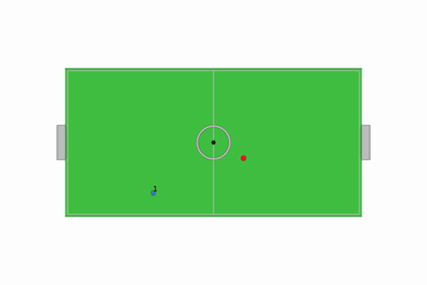

---

#### `mask_opponent` — Opponent Hidden
**Observed Behaviour:**
- Ignores opponent completely
- Direct, aggressive ball pursuit
- High-risk offensive strategy

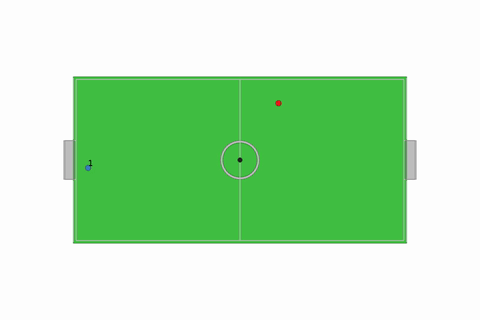

---

### Proximity-Based Masking

#### Ball Hidden When Close  
**Flags:** `mask_ball_by_distance`, `mask_if_far=False`

**Observed Behaviour:**
- Repeated tackling behaviour
- Focus on disrupting ball control rather than possession

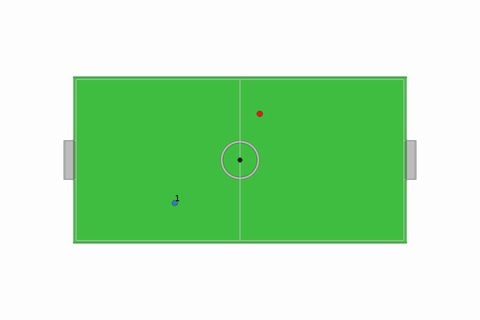

---

#### Ball Hidden When Far  
**Flags:** `mask_ball_by_distance`, `mask_if_far=True`

**Observed Behaviour:**
- Efficient navigation toward ball
- Standard offensive play

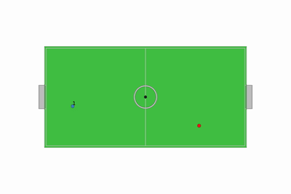

---

#### Opponent Hidden When Far
**Observed Behaviour:**
- Direct attacking play
- Minimal defensive awareness

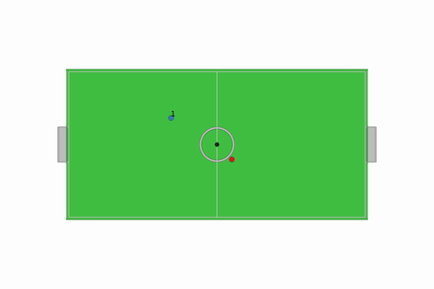

---

#### Opponent Hidden When Close
**Observed Behaviour:**
- Relies purely on ball dynamics
- Surprisingly effective scoring behaviour

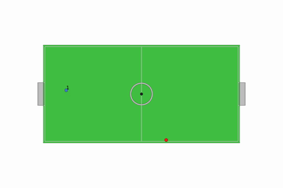

---

## 1v1 Emergent Behaviours Table

| Flags | Experiment | Agent behaviour | Visual Demonstration |
| :--- | :--- | :--- | :--- |
| `None` | Agent has full observability, used as a baseline. | Learns how to score towards the end of training. |  |
| `mask_pitch_rhs` | The offensive right hand side of the pitch is masked i.e. agent will not receive any information regarding the ball and opposing players when in that zone. | Learns a 'goalkeeper' role, i.e. stays close to its own goal and defends the ball. |  |
| `mask_pitch_lhs` | The defensive area (left 1/6th) of the pitch is masked i.e. the agent will not receive any information regarding the ball and opposing players when in that zone. | The agent learns defensive behaviour in the middle of the pitch. It doesn't score but prevents the other agent from scoring by intercepting the ball in the midfield, similar to a midfielder role and a hybrid between the goalkeeper and baseline behaviour. |  |
| `mask_ball` | Agent does not receive ball information in its observation. | Learns how to predict the trajectory of the ball via 'perpendicular bumping' near its own goal. It travels perpendicular to the opponent to repeatedly intercept the ball when it is being dribbled by the opponent. |  |
| `mask_opponent` | Agent does not receive information regarding the opponent. | Learns aggressive offensive behaviour and disregards the opponent by going straight towards the ball and attempting to score in the opposing goal, possibly being tackled by the opponent in the process. |  |
| `mask_ball_by_distance, mask_if_far` | Agent does not receive any ball information in its observation when it is close to the ball. | Compensates by learning to repeatedly tackle and trap the to prevent it from getting the ball. |  |
| `mask_ball_by_distance, mask_if_far` | Agent does not receive any ball information in its observation when it is far away from the ball. | Learns normal offensive behaviour to score and quickly heads towards the ball. |  |
| `mask_opponent_by_distance, mask_if_far` | Agent does not receive any opponent information in its obervation when it is far away from the ball. | Learns offensive and attacking behaviour to score. |  |
| `mask_opponent_by_distance, mask_if_far` | Agent does not receive any opponent information in its obervation when it is close to the ball. | Learns successful attacking and offensive behaviour to score by just using the ball. |  |
| `mask_pitch_bhs` | The bottom third of the pitch is masked i.e. agents will not receive any information regarding the ball and opposing players when in that zone. | Learns to play while avoiding the bottom third of the pitch and can score against opponent. |  |
| `mask_pitch_ths` | The top third of the pitch is masked i.e. agents will not receive any information regarding the ball and opposing players when in that zone. | Learns to play while avoiding the top third of the pitch, will stay at the border if opponent is in that zone and gives rise to more defensive behaviour. |  |